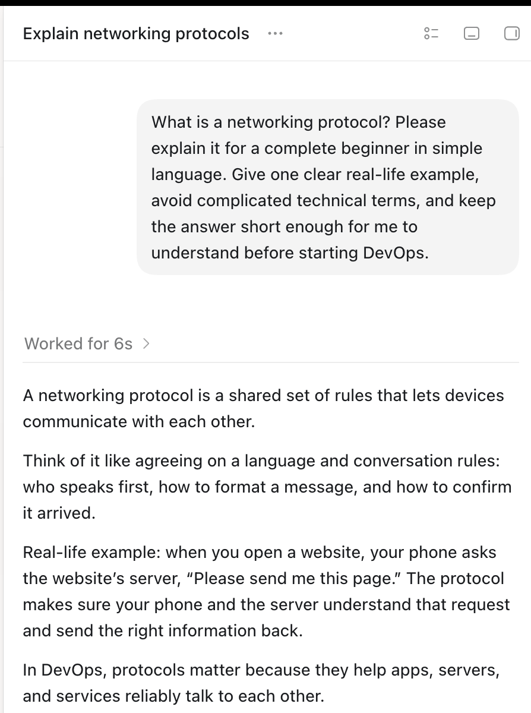
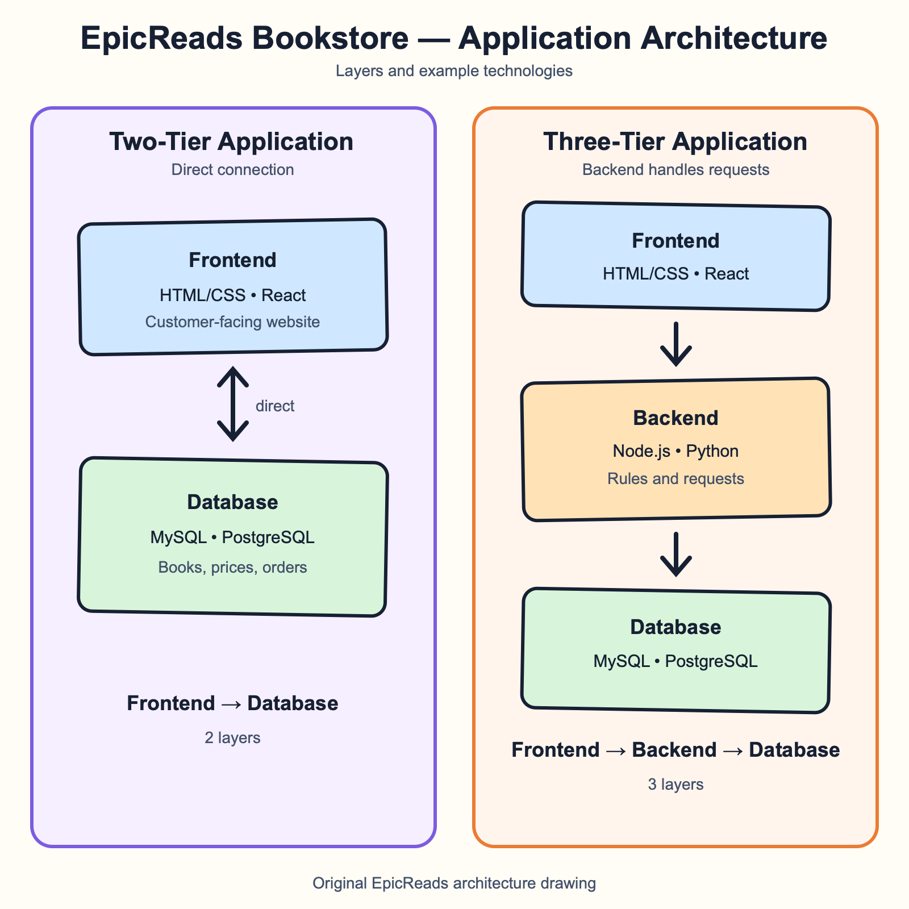
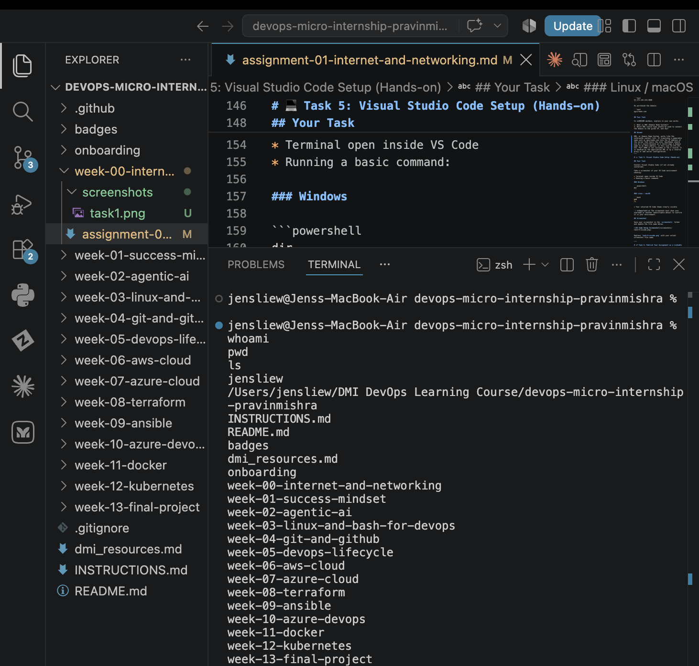

# Week 00 - Internet and Networking

Part of the DevOps Micro Internship (DMI) Cohort 3 with Agentic AI

---

# 🧑‍💻 Task 1: Using ChatGPT as Your Learning Assistant

## Scenario

You're new to DevOps and will frequently encounter technical questions. ChatGPT can be your learning companion.

## Your Task

Write a clear ChatGPT prompt to help you understand:

> "What is a protocol in networking? Explain with a simple real-life example."

Take a screenshot of your interaction showing:

* Your detailed prompt (with clear expectations)
* ChatGPT's simplified response with an example

## Screenshot

Save your screenshot in the `screenshots` folder and update the file name below.




Replace `task-1-chatgpt.png` with your actual screenshot file name.

---

## What I Learned (2–3 lines)

I learned that a networking protocol is a set of agreed rules that devices follow when they communicate. It is similar to people agreeing on how to start, speak during, and end a phone call. These rules help devices send and receive information correctly.
---

# 🌐 Task 2: Internet and Networking

## Scenario

Your friend is launching an online bookstore named **EpicReads**.

He asked you to explain how users globally can access his website hosted in Finland.

## Your Task

Write a short explanation (**100–150 words**) that includes:

* Packet Switching
* IP Address
* TCP/IP
* HTTP/HTTPS

💡 **Tip:** You may use ChatGPT (as demonstrated in Task 1) to refine your explanation.

## Answer

When a person in the USA opens the EpicReads website, their browser first needs the IP address of the server in Finland. An IP address is like the server’s numerical street address, so data knows where to go. The browser sends a request across many networks using TCP/IP. TCP breaks information into packets, checks that they arrive, and puts them back in the correct order; IP helps route each packet to the Finnish server. Packet switching means the packets can travel through different available routes instead of one fixed path. Finally, HTTP carries the web request and response. HTTPS is the secure version of HTTP: it encrypts the connection so details such as login information and payment data are protected while travelling across the internet.
---

# 🏗️ Task 3: Application Architecture & Stack

## Scenario

EpicReads bookstore has two application versions:

### Two-Tier Application

* Frontend
* Database

### Three-Tier Application

* Frontend
* Backend
* Database

## Your Task

* Draw simple diagrams (hand-drawn or tool-based such as draw.io)
* Label each layer clearly
* List at least two common technologies or tools used for each layer
* Submit a screenshot or photo clearly showing your own drawing

## Diagram Screenshot / Photo

Save your diagram image in the `screenshots` folder and update the file name below.




Replace `task-3-diagram.png` with your actual diagram file name.

---

## Technologies Used

### Frontend

- HTML and CSS
- JavaScript and React

### Backend

- Node.js with Express
- Python with Django or Flask

### Database

- MySQL
- PostgreSQL

---

# 🌍 Task 4: Domain Name & DNS (Basic Concepts)

## Scenario

Your friend's bookstore **EpicReads** is currently accessible through:

```text
52.172.142.222:3000
```

He purchased the domain:

```text
epicreads.com
```

## Your Task

In **50–100 words**, explain in your own words:

1. What is DNS (Domain Name System)?
2. Which DNS record type should be used to connect the domain to the given IP, and why?

## Answer

DNS, or Domain Name System, works like the internet’s contact list. It translates a memorable name such as epicreads.com into the IP address of the server that hosts the site. EpicReads should use an A record because an A record maps a domain name to an IPv4 address, in this case 52,172,142,222. Port 3000 is not included in the A record; it is handled by the application URL or by a reverse proxy or web server configuration.
---

# 💻 Task 5: Visual Studio Code Setup (Hands-on)

## Your Task

Install Visual Studio Code (if not already installed).

Take a screenshot of your VS Code environment showing:

* Terminal open inside VS Code
* Running a basic command:

### Windows

```powershell
dir
```

### Linux / macOS

```bash
pwd
ls
```

* Your selected VS Code theme clearly visible

⚠️ **Important:** The screenshot must show your username or another identifiable detail to confirm it is your environment.

## Screenshot

Save your screenshot in the `screenshots` folder and update the file name below.




Replace `task-5-vscode.png` with your actual screenshot file name.

---

# 🔗 Task 6: Publish Your Assignment as a LinkedIn Post

## Objective

Publishing on LinkedIn helps you:

* Build your professional online presence
* Reinforce your learning
* Document your DevOps journey publicly

## Your Task

Summarize your answers from Tasks 1–5 into a LinkedIn post.

Clearly structure your post into the following sections:

* ChatGPT
* Internet & Networking
* App Architecture
* DNS
* VS Code Setup

Use the credit note that matches your track:

Add the following credit note at the end of your post **(If you are DMI Cohort 3 student)**:

> **P.S. This post is part of the DevOps Micro Internship (DMI) with Agentic AI — Cohort 3 — by Pravin Mishra. My graded progress is public: https://dmi.pravinmishra.com/s/YOUR-GITHUB-USERNAME.html · Start your DevOps journey: https://dmi.pravinmishra.com/?utm_source=student&utm_medium=ps-linkedin&utm_campaign=cohort3**


Add the following credit note at the end of your post **(If you are DMI Self-paced track student)**:

> **P.S. This post is part of the DevOps Micro Internship (DMI) — Self-Paced Engineer Track — by Pravin Mishra. My graded progress is public: https://dmi.pravinmishra.com/s/YOUR-GITHUB-USERNAME.html · Start your DevOps journey: https://dmi.pravinmishra.com/?utm_source=student&utm_medium=ps-linkedin&utm_campaign=self-paced**

Add the following credit note at the end of your post **(If you are DMI Campus student)**:

> **P.S. This post is part of the DevOps Micro Internship (DMI) — Campus — by Pravin Mishra. My graded progress is public: https://dmi.pravinmishra.com/s/YOUR-GITHUB-USERNAME.html · Start your DevOps journey: https://dmi.pravinmishra.com/?utm_source=student&utm_medium=ps-linkedin&utm_campaign=campus**

Replace `YOUR-GITHUB-USERNAME` with your GitHub username — that link is your public DMI progress page (your graded badge page).
---

## LinkedIn Post URL

Paste your LinkedIn post URL here:

```text
https://lnkd.in/p/gN7EJycT```

---

## LinkedIn Post Backup Copy

Paste the full text of your LinkedIn post here:

I’ve completed Week 00 of my DevOps Micro Internship journey, where I built a stronger foundation in internet networking, application architecture, DNS, and essential developer tools. I now have a clearer idea of what happens behind the scenes when a website loads — thankfully, it is more than just hoping the Wi-Fi behaves. 😄

I’m learning through the DevOps Micro Internship, a self-paced and hands-on programme where we complete practical weekly tasks, track our progress publicly, and compete on a leaderboard. A little friendly competition is a good reason not to postpone the next assignment.

This week focused on the foundations behind the websites and tools we use every day.

💬 ChatGPT as a learning assistant  
I practised writing clearer prompts to understand networking protocols in simple language. My biggest lesson: asking a better question usually gives a much better answer.

🌐 Internet & Networking  
I learned how someone in the USA can access a website hosted in Finland. IP addresses point data in the right direction, TCP/IP helps deliver it properly, packet switching finds a route, and HTTPS keeps private information private.

🏗️ Application Architecture  
I compared two-tier and three-tier applications. Adding a backend layer makes much more sense now — it is basically the organised middle person between the frontend and the database.

🌍 DNS  
DNS is like the internet’s contact list: we type `epicreads.com`, and DNS helps find the server’s IP address. For an IPv4 server, the correct record is an A record.

💻 VS Code Setup  
I explored VS Code and its integrated terminal. It was satisfying to run a few commands and actually understand what they were showing me — small wins count.

Week 00 was a great starting point. On to the next task, the next skill, and hopefully a slightly higher leaderboard position. 🚀

P.S. This post is part of the DevOps Micro Internship (DMI) — Campus — by Pravin Mishra. My graded progress is public: https://dmi.pravinmishra.com/s/jensliew.html · Start your DevOps journey: https://dmi.pravinmishra.com/?utm_source=student&utm_medium=ps-linkedin&utm_campaign=campus

#DMIByPravinMishra #DevOps #Networking #LearningInPublic #VSCode #CloudComputing
---

# Reflection – Week 0

### What did you find easy?

I found it easy to understand DNS because it works like finding a contact by name instead of remembering a phone number. I also enjoyed exploring VS Code and using its integrated terminal.
---

### What was difficult?

At first, it was difficult to understand how IP addresses, packet switching, TCP/IP, and HTTPS all work together when someone opens a website. Drawing the application architectures helped make the roles of each layer clearer.
---

### What will you improve next week?

Next week, I will practise terminal commands more regularly and improve how I explain technical concepts in simple language. I also want to become more confident with GitHub and keep my assignment evidence organised as I work.
---

## 📌 About DMI & CloudAdvisory

DevOps Micro Internship (DMI) is a project-based DevOps program run by Pravin Mishra (The CloudAdvisory) focused on real-world execution, systems thinking, and career readiness.

It helps learners build strong DevOps foundations with hands-on experience.


## 📌 Resources

- 🌐 **DMI Official Website:** https://dmi.pravinmishra.com?utm_source=github&utm_medium=readme  
- 🎓 **University:** https://university.pravinmishra.com?utm_source=github&utm_medium=readme  
- 💬 **Discord Community:** https://discord.pravinmishra.com?utm_source=github&utm_medium=readme  
- 📝 **Blog:** https://dmi.pravinmishra.com/blog?utm_source=github&utm_medium=readme  
- ▶️ **YouTube Playlist (DMI Cohort 3):** https://www.youtube.com/playlist?list=PLFeSNDtI4Cho  
- 🔗 **Pravin Mishra (LinkedIn):** https://www.linkedin.com/in/pravin-mishra-aws-trainer/  
- 🏢 **CloudAdvisory (LinkedIn):** https://www.linkedin.com/company/thecloudadvisory/

---

*This submission is part of DevOps Micro Internship (DMI) Cohort 3 — Agentic AI Track*